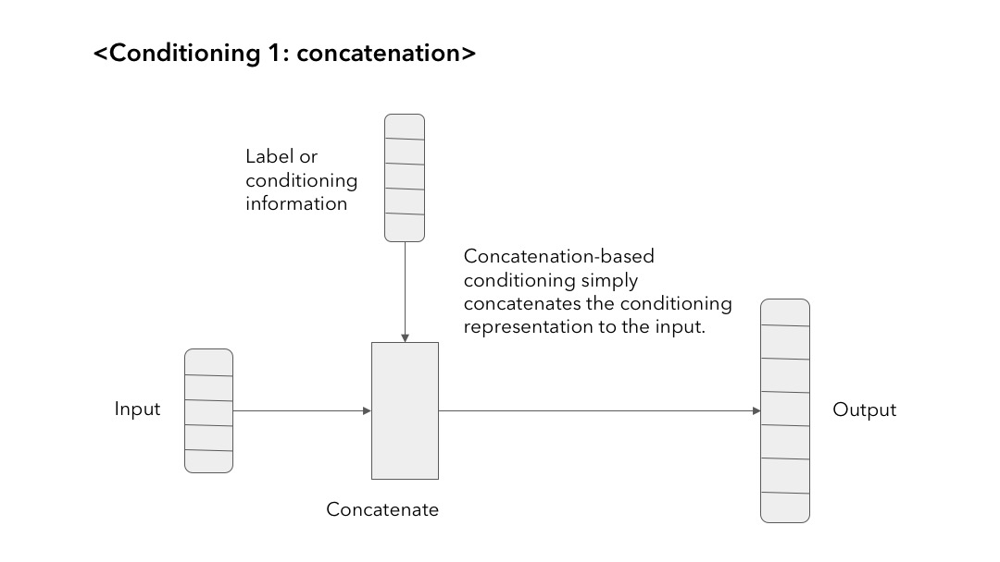
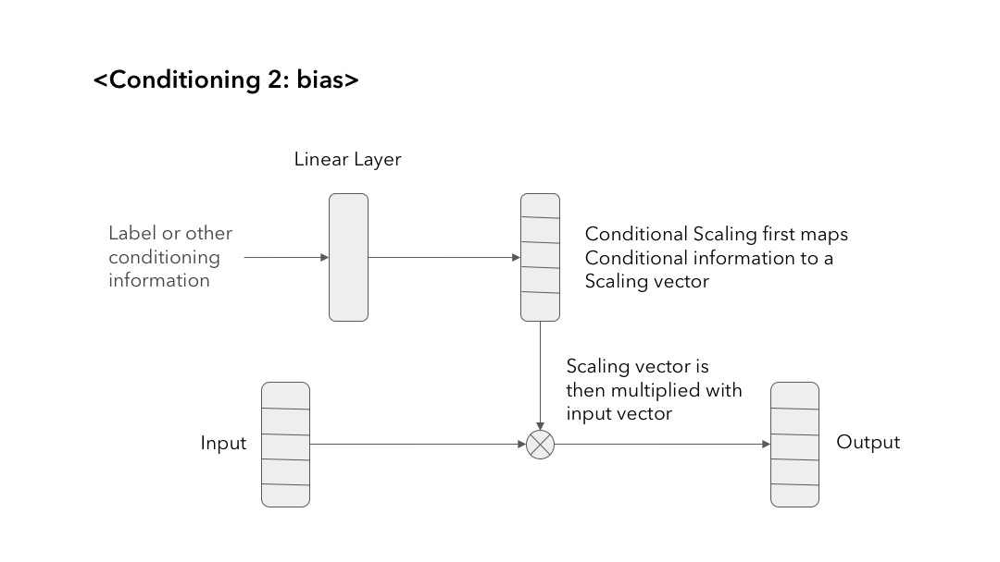

# Conditional WaveGAN

In this project we developed Conditional WaveGAN to synthesize speech/audio samples that are conditioned on class labels. The thus synthesized raw audio is used for improving the baseline ASR system.

## Getting Started

Generative models are successfully used for image synthesis in the recent years. But when it comes to other modalities like audio, text, and etc, little progress has been made. Recent works focus on generating audio from a generative model in an unsupervised setting. We explore the possibility of using generative models conditioned on class labels.

## Conditioning Methods







## Usage

Training can be done in both GPU and TPU settings. Only concatenation based conditioning is available in GPU, whereas bias based conditioning is also available in TPU.

### Prerequisites

* Tensorflow >= 1.4
* Python 2.7

### Datasets

1. [Speech Commands Zero through Nine (SC09)](https://drive.google.com/open?id=1qRdAWmjfWwfWIu-Qk7u9KQKGINC52ZwB)
2. Techsorflow Challenge [Speech Commands data full](https://www.kaggle.com/c/tensorflow-speech-recognition-challenge/data)

Data must assume the form of `tf.Data.TFRecord`. The label data must be in one hot encoded for concatenation based conditioning, whereas it must be simple integers for bias based conditioning. Thus, the code to make the TFRecord differs by the type of conditioning.

```
python make_tfrecord.py \
	new/sc09/train \
	new/sc09_tf \
	--name train --labels \
	--ext wav \
	--fs 16000 \
	--nshards 128 \
	--slice_len 1 \
```

### Training in GPU

To begin or resume training

```
python gpu/train_wavegan.py train ./gpu/train \
	--data_dir ./data/customdataset
```

To save the checkpoints every specified minutes while training

```
# save checkpoints every 60 minutes
python gpu/backup.py ./gpu/train 60
```

To generate 20 preview audio samples with two per class

```
python gpu/train_wavegan.py preview ./gpu/preview
```

### Training in TPU

Setting up TPU is explained [here](https://medium.com/@cylee_80935/how-to-use-google-cloud-tpus-177c3a025067).

To begin or resume training

```
# concatenation based conditioning
python tpu/concat_main.py

# bias based conditioning
python tpu/bias_main.py
```

Create a bucket for backup checkpoints and name it `[CKPT_BUCKET_NAME]-backup`. To save the checkpoints every specified minutes while training

```
# save checkpoints every 60 minutes
python tpu/backup.py gs://ckpt 60
```

To generate 20 preview audio samples with two per class

```
python tpu/preview.py
```

### References

* Donahue, Chris, Julian McAuley, and Miller Puckette. "Synthesizing Audio with Generative Adversarial Networks." arXiv preprint arXiv:1802.04208 (2018). [paper](https://arxiv.org/abs/1802.04208)
* Shen, Jonathan, et al. "Natural TTS synthesis by conditioning wavenet on mel spectrogram predictions." arXiv preprint arXiv:1712.05884 (2017). [paper](https://arxiv.org/pdf/1712.05884.pdf)
* Perez, Anthony, Chris Proctor, and Archa Jain. Style transfer for prosodic speech. Tech. Rep., Stanford University, 2017. [paper](http://web.stanford.edu/class/cs224s/reports/Anthony_Perez.pdf)
* Goodfellow, Ian, et al. "Generative adversarial nets." Advances in neural information processing systems. 2014. [paper](https://arxiv.org/pdf/1406.2661.pdf)
* Salimans, Tim, et al. "Improved techniques for training gans." Advances in Neural Information Processing Systems. 2016. [paper](https://arxiv.org/pdf/1606.03498.pdf)
* Grinstein, Eric, et al. "Audio style transfer." arXiv preprint arXiv:1710.11385 (2017). [paper](https://arxiv.org/abs/1710.11385)
* Pascual, Santiago, Antonio Bonafonte, and Joan Serra. "SEGAN: Speech enhancement generative adversarial network." arXiv preprint arXiv:1703.09452 (2017). [paper](https://arxiv.org/pdf/1703.09452.pdf)
* Yongcheng Jing, Yezhou Yang, Zunlei Feng, Jingwen Ye, Yizhou Yu, Mingli Song. "Neural Style Transfer: A Review" 	arXiv:1705.04058 (2017) [paper](https://arxiv.org/abs/1705.04058v6)
* Van Den Oord, Aäron, et al. "Wavenet: A generative model for raw audio." CoRR abs/1609.03499 (2016). [paper](https://arxiv.org/abs/1609.03499)
* Glow: Generative Flow with Invertible 1×1 Convolutions [paper](https://d4mucfpksywv.cloudfront.net/research-covers/glow/paper/glow.pdf)
* Kingma, Diederik P., et al. "Semi-supervised learning with deep generative models." Advances in Neural Information Processing Systems. 2014. [paper](https://arxiv.org/abs/1406.5298)
* Van Den Oord, Aäron, et al. "Wavenet: A generative model for raw audio." CoRR abs/1609.03499 (2016). [paper](https://arxiv.org/abs/1609.03499)


## Authors

* **Anoop Toffy** - *IIIT Bangalore* - [Personal Website](www.anooptoffy.com)
* **Chae Young Lee** - *Hankuk Academy of Foreign Studies* - [Homepage](https://github.com/acheketa)

## License

This project is licensed under the MIT License - see the [LICENSE.md](LICENSE.md) file for details

## Acknowledgments

* Dr. Gue Jun Jung, Speech Recognition Tech, SK Telecom
* Dr. Woo-Jin Han, Netmarble IGS
* Tensorflow Korea
* Google

This was supported by [Deep Learning Camp Jeju 2018](http://jeju.dlcamp.org/2018/) which was organized by [TensorFlow Korea User Group](https://facebook.com/groups/TensorFlowKR/).
